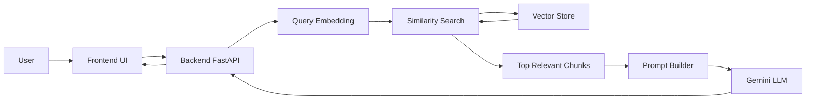
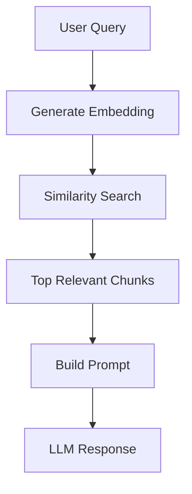

#  RAG GenAI Chat Assistant

## 1. Project Overview
This project is a production-ready Retrieval-Augmented Generation (RAG) chat assistant for AI learning topics such as Machine Learning (ML), Deep Learning (DL), and NLP.

The system retrieves relevant knowledge chunks before calling the LLM, so answers are grounded in known context and hallucination risk is reduced.

## 2. Tech Stack
- **Large Language Model API (Gemini):** Generates final natural-language responses from a grounded prompt.
- **Embeddings API (Gemini Embeddings):** Converts text into vectors using `gemini-embedding-001` for semantic retrieval.
- **RAG (Retrieval-Augmented Generation):** Injects retrieved context into prompts so responses are based on source material.
- **Backend (FastAPI):** Handles chat API, retrieval orchestration, prompt construction, and Gemini calls.
- **Frontend (React + Vite):** Provides the chat interface, session handling, and API communication.
- **Vector Storage Approach:**
  - Processed embedding store in `backend/data/vector_store.json`
  - In-memory chat session memory (last 5 messages per session)

## 3. Architecture Diagram


## 4. RAG Workflow Explanation
1. User sends a query from the chat UI.
2. Backend generates a query embedding.
3. Similarity search runs against stored document embeddings.
4. Top relevant chunks are retrieved.
5. Prompt is constructed with strict grounding rules.
6. Gemini LLM generates the final response.



## 5. Embedding Strategy
Embeddings are used to map text into vector space so semantic similarity can be computed efficiently.

- **Document Embeddings:** Used during ingestion for knowledge chunks.
  - Task type: `RETRIEVAL_DOCUMENT`
- **Query Embeddings:** Used at runtime for user questions.
  - Task type: `RETRIEVAL_QUERY`
- **Model:** `gemini-embedding-001`

This separation improves retrieval quality because query intent and document representation are optimized differently.

## 6. Similarity Search Explanation
The system uses **cosine similarity** to compare the query vector with stored chunk vectors.

Why cosine similarity:
- Measures directional similarity in high-dimensional space
- Scale-invariant and widely used for semantic retrieval

Threshold filtering is applied to remove low-relevance matches before selecting top chunks.

Example:
- A query about **overfitting** retrieves chunks discussing generalization, regularization, validation, and model complexity.

## 7. Prompt Design Reasoning
The prompt is designed for strict grounding:
- **Context has highest priority**
- **Chat history is secondary** and only for continuity
- If context is insufficient, the model must return: **"I don't know"**

This structure reduces hallucination and enforces traceable responses.

Example prompt snippet:

```text
You are a helpful AI assistant.

STRICT RULES:
- Answer ONLY from provided context
- Chat history is only for continuity
- If answer not found -> say 'I don't know'

CONTEXT:
{retrieved_chunks}

CHAT HISTORY:
{formatted_history}

USER QUESTION:
{query}

ANSWER:
```
# Doc Creations you can also create the docs like I Created like this 
```bash
{
    "id": "doc_001",
    "title": "Machine Learning Basics",
    "content": "Machine learning is a branch of AI where systems learn patterns from data instead of fixed rules.\nSupervised learning uses labeled examples to map inputs to known outputs.\nUnsupervised learning finds structure in unlabeled data, such as clusters or latent factors.\nFeatures are measurable input variables, and labels are the target values to predict.\nData quality, preprocessing, and representative sampling strongly influence model performance."
  }
```
## 8. Setup Instructions
### Backend
```bash
cd backend
python -m venv .venv
# Windows PowerShell
.\.venv\Scripts\Activate.ps1
pip install -r requirements.txt
copy .env.example .env
```

Set in `backend/.env`:
```env
GEMINI_API_KEY=your_api_key_here
APP_PORT=8000
```

Run backend:
# first :
```bash
python backend/scripts/ingest.py
```
# run this to Ingest documents, chunk content, generate embeddings, and build a vector store
```bash
uvicorn main:app --reload --host 0.0.0.0 --port 8000
```

### Frontend
```bash
cd frontend
npm install
copy .env.example .env
```

Set in `frontend/.env`:
```env
VITE_API_URL=http://localhost:8000
```

Run frontend:
```bash
npm run dev
```

### Deployment
- **Backend:** Deploy FastAPI service on Render
- **Frontend:** Deploy React/Vite app on Vercel
- Set production env vars:
  - Backend: `GEMINI_API_KEY`
  - Frontend: `VITE_API_URL=<your-render-backend-url>`

## 9. Features
- RAG-based retrieval pipeline
- Grounded responses with strict prompt rules
- React chat interface with session continuity
- In-memory session memory (last 5 messages)
- Deployment-ready backend and frontend separation

## 10. Future Improvements
- Replace JSON vector store with FAISS/Pinecone
- Add authentication and rate limiting
- Improve UI/UX with richer chat controls and observability
